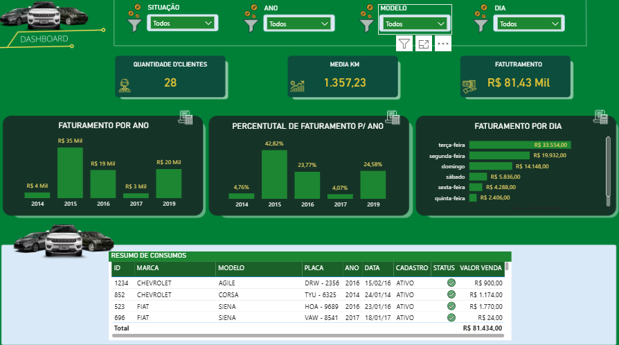
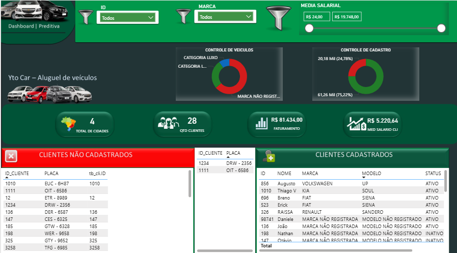
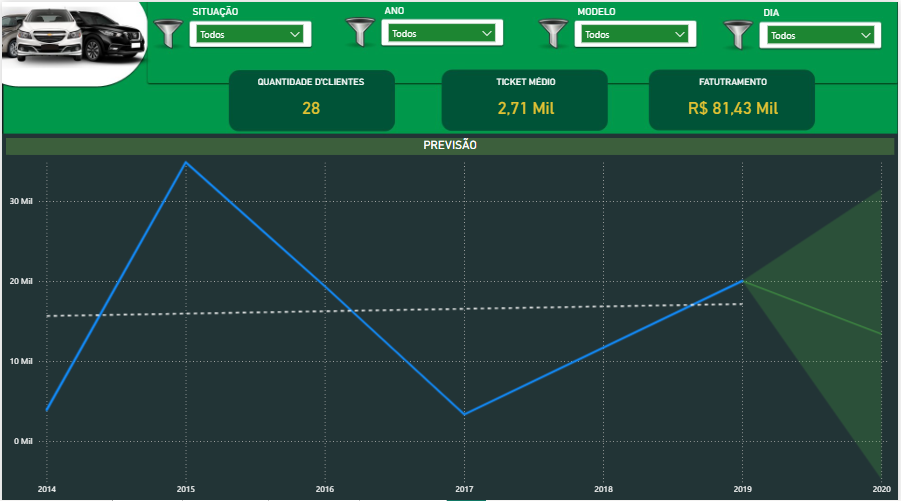

# Power BI Dashboard - Yto Car - Análise de Veículos

## Descrição
Este projeto consiste em um dashboard desenvolvido no Power BI para a análise de dados relacionados à frota de veículos da empresa Yto Car. O dashboard apresenta indicadores-chave de desempenho (KPIs), gráficos e tabelas que ajudam na visualização de informações sobre clientes, faturamento, consumo e status de cadastro.

## Funcionalidades
- **Quantidade de Clientes**: Exibe o total de clientes (28 no momento).
- **Ticket Médio**: Mostra o valor médio por cliente (R$ 2,71 Mil).
- **Faturamento Total**: Apresenta o faturamento acumulado (R$ 81,43 Mil).
- **Faturamento por Ano**: Gráfico de barras com o faturamento anual de 2014 a 2019.
- **Percentual de Faturamento por Ano**: Gráfico de barras com a distribuição percentual do faturamento.
- **Faturamento por Dia**: Detalhamento do faturamento por dia da semana.
- **Resumo de Consumo**: Tabela com informações de ID, marca, modelo, placa, ano, cadastro, status e valor de venda.
- **Previsão**: Gráfico de linha com a evolução do faturamento ao longo dos anos e uma projeção até 2020.
- **Clientes Cadastrados**: Tabela com detalhes de clientes, incluindo ID, placa, marca, modelo e status.
- **Controle de Cadastro**: Indicadores de controle de cadastro e categoria de veículos.

## Estrutura do Projeto
- **Dashboard Principal**: Inclui filtros interativos por situação, ano, modelo e dia.
- **Gráficos e Tabelas**: Visualizações dinâmicas para análise detalhada.
- **Indicadores**: KPIs como total de clientes, faturamento e média salarial.

## Como Usar
1. Abra o arquivo `.pbix` no Power BI Desktop.
2. Conecte-se aos dados fontes (se necessário, atualize as conexões de dados).
3. Utilize os filtros no topo do dashboard para personalizar a visualização.
4. Explore os gráficos e tabelas para análise detalhada.

## Requisitos
- Power BI Desktop (versão mais recente recomendada).
- Acesso aos dados fontes (ex.: Excel, SQL Server, etc., dependendo da origem).

## 📷 Demonstração

> O dashboard é totalmente interativo, permitindo análises rápidas e comparativos entre períodos.

## Contribuições
Contribuições são bem-vindas! Por favor, envie um pull request ou abra uma issue para sugestões e melhorias.

## Licença
Este projeto é de uso interno da Yto Car e não possui licença pública. Para uso externo, entre em contato com o responsável pelo projeto.

## Contato
Para dúvidas ou suporte, entre em contato com a equipe de TI da Yto Car.
